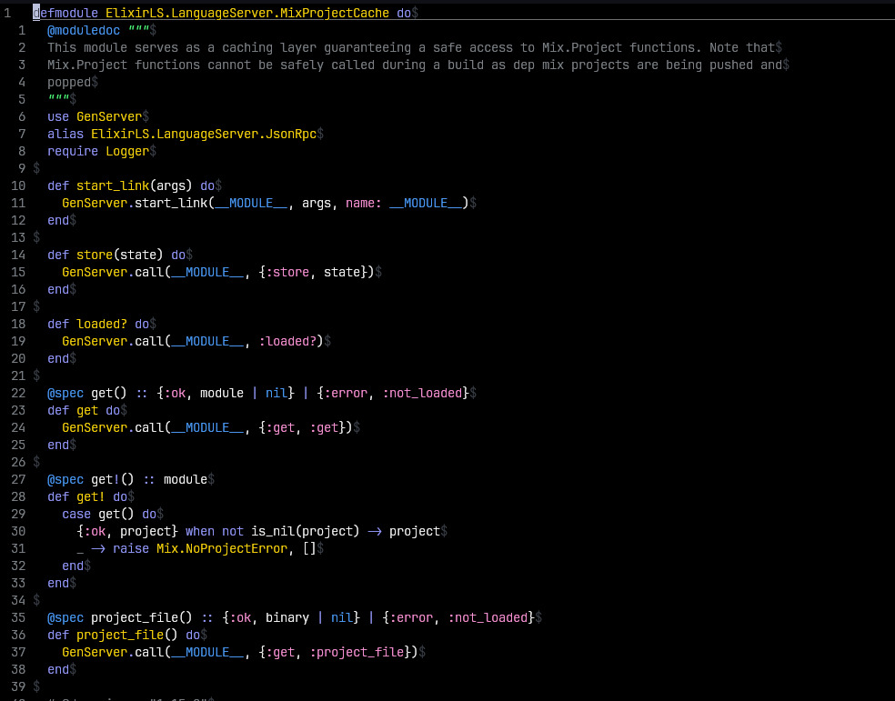

# gemini.vim
vim (not lua) colorscheme in the colors as shown in code examples when using gemini AI



```biash 
git clone https://github.com/eddy147/gemini.vim.git ~/.vim/pack/plugins/start/gemini.vim
```

```vim
Plug 'eddy147/gemini.vim'
```

```vim
syntax enable
set termguicolors " if 24-bit color is supported
colorscheme gemini
```

